# TowelShop42 Frontend

[ README IN PROGRESS ]

This is the frontend for the TowelShop42 fullstack project.
For informations about the backend, please check [this other repo](https://github.com/MarinaFroes/towelshop-service).

See Screenshots bellow.

<h2 align="center">Home page</h2>

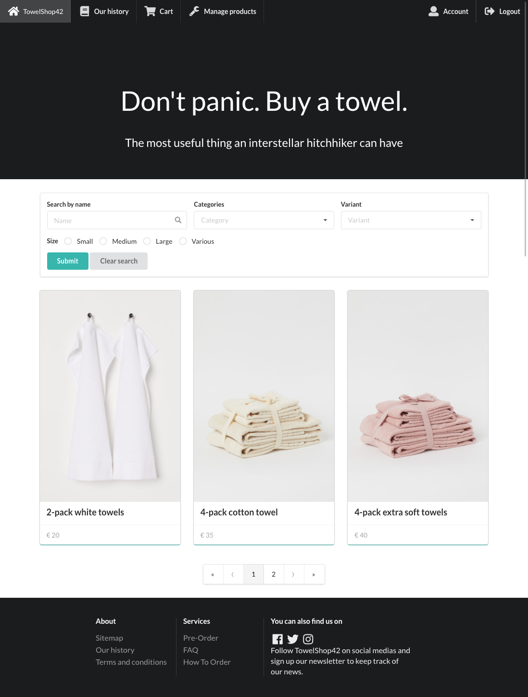

<h2 align="center">Home page with search</h2>

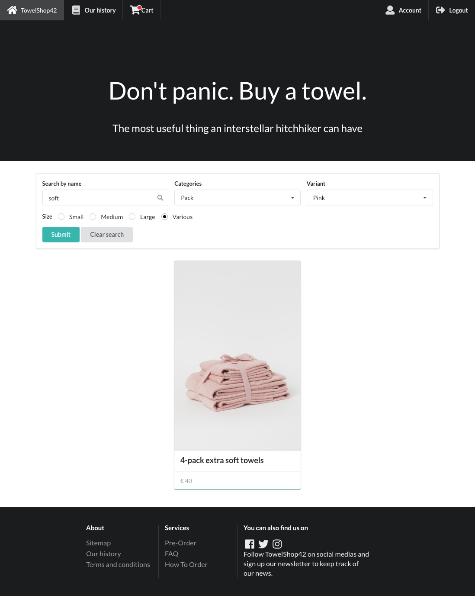

<h2 align="center">Our History Page</h2>

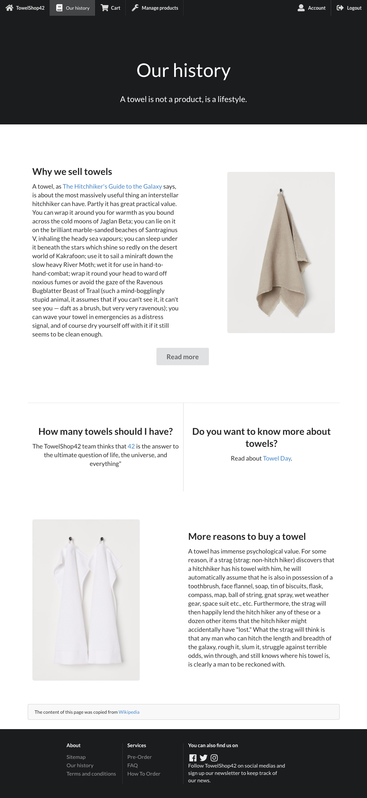

<h2 align="center">Login Page</h2>

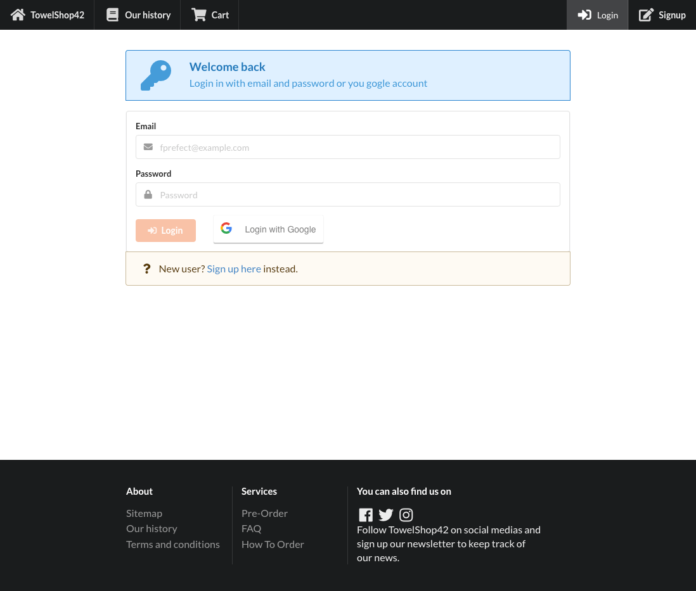

<h2 align="center">Account Page Admin</h2>

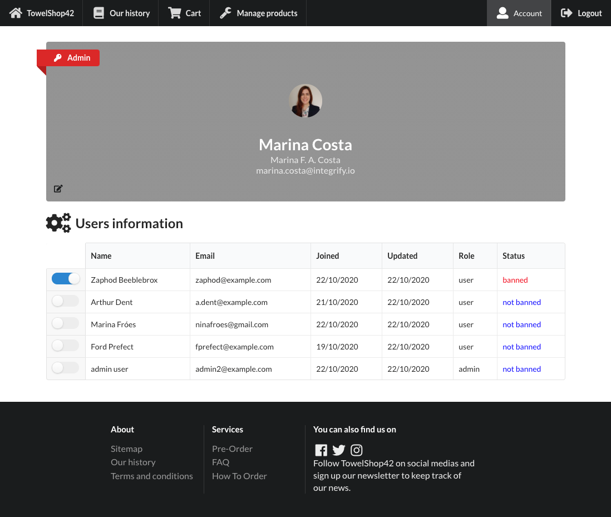

<h2 align="center">Account Page User</h2>

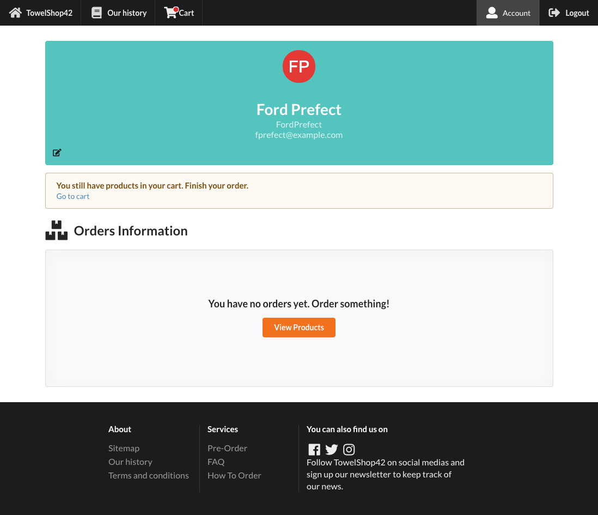

<h2 align="center">User Edit Page</h2>

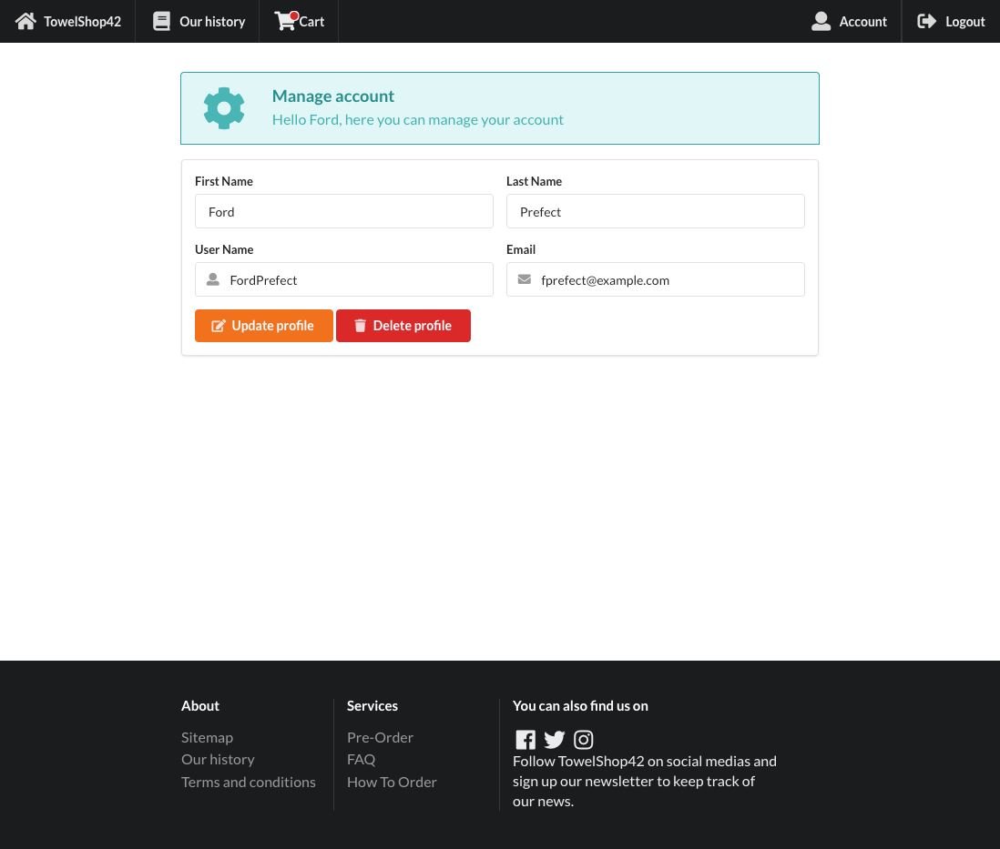

<h2 align="center">Product Page</h2>

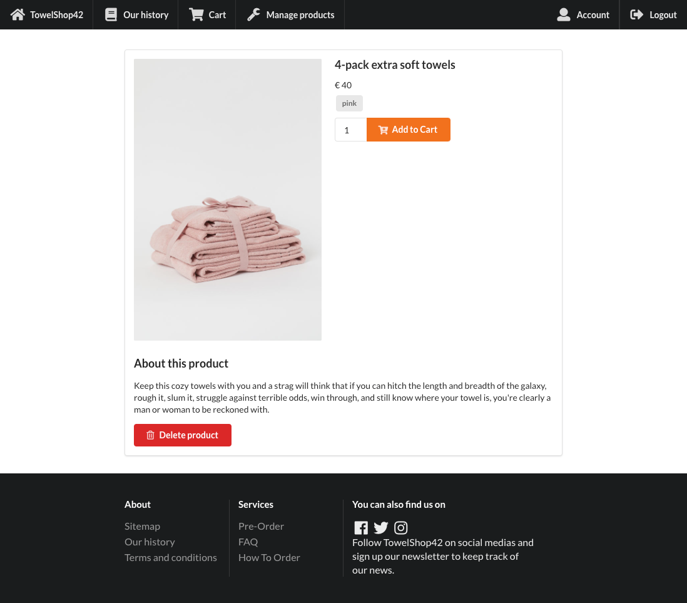

<h2 align="center">Manage Products Page</h2>

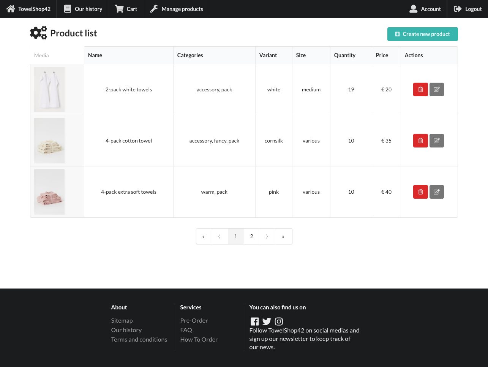

<h2 align="center">Edit Product Page</h2>

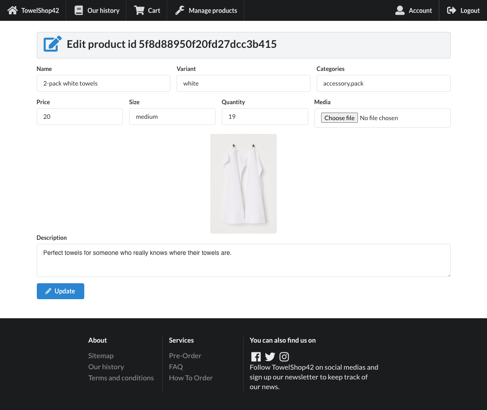

<h2 align="center">Cart Page</h2>

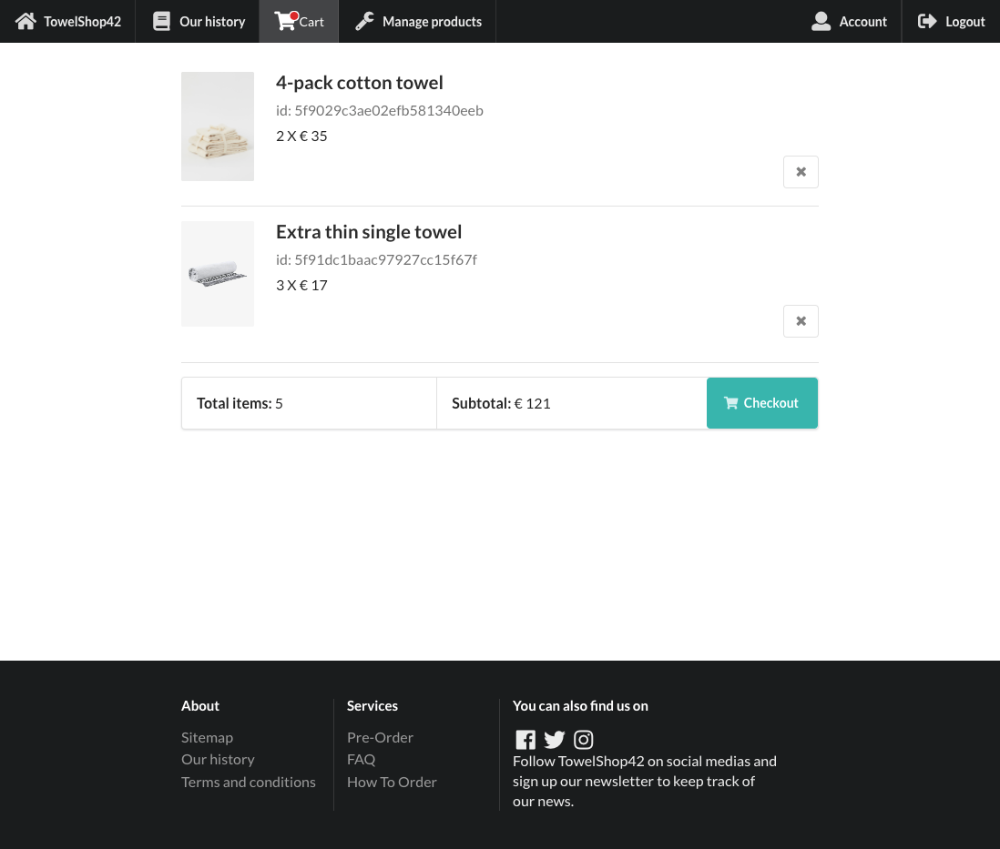

<h2 align="center">Not Found Page</h2>

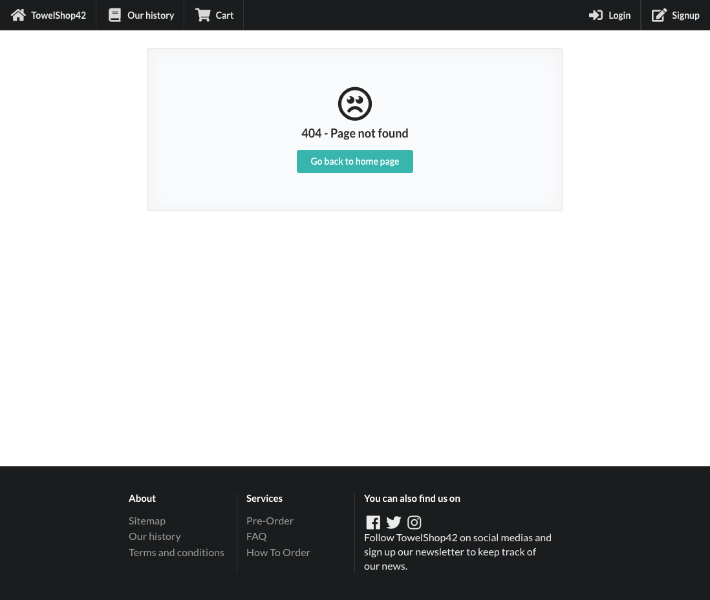

